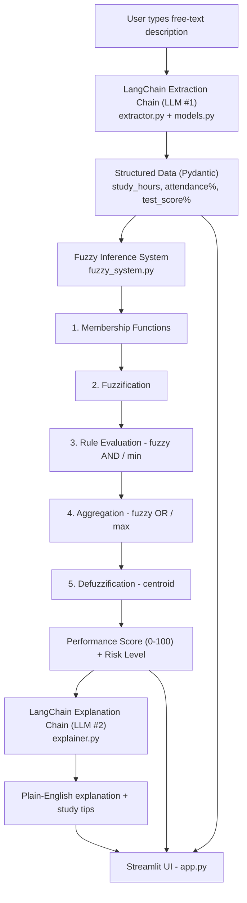

# 🎓 AI-Based Student Academic Performance & Study Recommendation System Using Fuzzy Logic

A college mini project that combines **LangChain (LLM-powered language understanding)**
with a **hand-built Fuzzy Inference System** to turn a plain-English description of a
student's study habits into an academic risk score and personalised study advice.

> Example input: *"I studied 2 hours today, my attendance is 68%, and I scored 55% in my last test."*

---

## 1. Architecture



Two separate LLM calls are made:
1. **Extraction** — reads the free-text sentence and pulls out three numbers.
2. **Explanation** — reads the *fuzzy result* (not the raw text) and writes advice.

The fuzzy engine in between never calls an LLM — it is deterministic, transparent math.

---

## 2. Project structure

```
student-performance-fuzzy-ai/
├── app.py              # Streamlit UI - orchestrates the whole pipeline
├── models.py            # Pydantic schema for the data LangChain extracts
├── llm_config.py         # Builds the LangChain LLM (Groq/OpenAI switch)
├── extractor.py          # LangChain chain #1: free text -> structured data
├── fuzzy_system.py        # The fuzzy inference engine (pure NumPy, no LLM)
├── visualization.py       # Matplotlib plots of membership functions
├── explainer.py           # LangChain chain #2: fuzzy result -> explanation
├── requirements.txt
├── .env.example
├── .gitignore
└── README.md
```

Each file has exactly one job, which makes it easy to point to a specific
file and explain that one part of the pipeline during a viva.

---

## 3. The Fuzzy Inference System (fuzzy_system.py)

The engine is implemented **from scratch with NumPy** (no `scikit-fuzzy` or other
fuzzy-logic library), so every step is plain, readable code — nothing is hidden
inside a library call, and there is **no if-else decision logic** anywhere.

### Inputs & membership functions

| Variable | Range | Low / Poor | Medium / Average | High / Good |
|---|---|---|---|---|
| Study hours | 0–12 hrs/day | trapezoid (0, 0, 1, 3) | triangle (1, 4, 7) | trapezoid (5, 8, 12, 12) |
| Attendance | 0–100 % | trapezoid (0, 0, 40, 60) | triangle (40, 65, 85) | trapezoid (70, 85, 100, 100) |
| Test score | 0–100 % | trapezoid (0, 0, 35, 50) | triangle (35, 55, 75) | trapezoid (60, 80, 100, 100) |

### Output variable — Academic Performance Score (0–100)

| Label | Shape |
|---|---|
| Low (High Risk) | trapezoid (0, 0, 25, 45) |
| Medium (Moderate Risk) | triangle (30, 50, 70) |
| High (Good Performance) | trapezoid (55, 75, 100, 100) |

### The 5 steps, and where to find them in code

| Step | What it does | Function |
|---|---|---|
| 1. Membership functions | Define the shape of Low/Medium/High for every variable | `trimf`, `trapmf` |
| 2. Fuzzification | Convert one crisp number into membership degrees | `fuzzify()` |
| 3. Rule evaluation | Combine degrees per rule using fuzzy AND (`min`) | `evaluate_rules()` |
| 4. Aggregation | Combine rules that share a conclusion using fuzzy OR (`max`) | `evaluate_rules()` |
| 5. Defuzzification | Clip output shapes at rule strength, union them, take the centroid | `defuzzify()` |

### Fuzzy rule base (18 rules)

The rule base is designed across three logical tiers where test scores, attendance, and study hours work together:
- **High Performance (R1–R4)**: Strong test scores reinforced by good attendance or study hours, or medium scores elevated by both high attendance and high study hours.
- **Medium Performance / Moderate Risk (R5–R12)**: Average habits, risk-compromise rules (e.g. high test score compromised by poor attendance or low study hours), and effort-cushion rules (e.g. low test score mitigated by diligent attendance and high study hours).
- **Low Performance / High Risk (R13–R18)**: Low test scores combined with poor or average habits, or poor attendance combined with low study hours.

```
--- High Performance (Low Risk) ---
R1:  Score=High   AND Attendance=Good                                -> Performance=High
R2:  Score=High   AND StudyHours=High                                -> Performance=High
R3:  Score=High   AND Attendance=Average AND StudyHours=Medium       -> Performance=High
R4:  Score=Medium AND Attendance=Good    AND StudyHours=High         -> Performance=High

--- Medium Performance (Moderate Risk) ---
R5:  Score=Medium AND Attendance=Average                             -> Performance=Medium
R6:  Score=Medium AND StudyHours=Medium                              -> Performance=Medium
R7:  Score=Medium AND Attendance=Good                                -> Performance=Medium
R8:  Score=Medium AND StudyHours=Low                                 -> Performance=Medium
R9:  Score=Medium AND Attendance=Poor                                -> Performance=Medium
R10: Score=High   AND Attendance=Poor                                -> Performance=Medium
R11: Score=High   AND StudyHours=Low                                 -> Performance=Medium
R12: Score=Low    AND Attendance=Good    AND StudyHours=High         -> Performance=Medium

--- Low Performance (High Risk) ---
R13: Score=Low    AND Attendance=Poor                                -> Performance=Low
R14: Score=Low    AND StudyHours=Low                                 -> Performance=Low
R15: Score=Low    AND Attendance=Average                             -> Performance=Low
R16: Score=Low    AND StudyHours=Medium                              -> Performance=Low
R17: Score=Medium AND Attendance=Poor    AND StudyHours=Low          -> Performance=Low
R18: Attendance=Poor AND StudyHours=Low                              -> Performance=Low
```

- **R10 & R11** ensure that even if a student scored high on an exam, poor attendance or cramming/low study is flagged as moderate risk going forward.
- **R12** ensures that a single bad exam does not condemn a student to "High Risk" if they maintain good attendance and high daily study hours.
- **R18** flags poor habits (poor attendance and low study) as high risk.

You can run the engine standalone to see this in action:

```bash
python fuzzy_system.py
```

---

## 4. The LangChain flow

| Chain | File | Input | Output |
|---|---|---|---|
| Extraction | `extractor.py` | Free-text sentence | `StudentAcademicData` (Pydantic) |
| Explanation | `explainer.py` | Fuzzy score + level + original text | Markdown explanation & tips |

Extraction uses `llm.with_structured_output(StudentAcademicData, method="function_calling")` —
this makes the LLM call a "tool" whose parameters match the Pydantic schema in
`models.py`, so the response is guaranteed to be valid, typed data instead of a
string you'd have to parse yourself.

The LLM provider is configured once in `llm_config.py` and used by both chains,
so switching providers never touches `extractor.py` or `explainer.py`.

---

## 5. Setup (run locally)

```bash
# 1. Clone and enter the project
git clone <your-repo-url>
cd student-performance-fuzzy-ai

# 2. Create a virtual environment
python -m venv venv
source venv/bin/activate      # Windows: venv\Scripts\activate

# 3. Install dependencies
pip install -r requirements.txt

# 4. Configure your API key
cp .env.example .env
# then edit .env and paste in your key

# 5. Run the app
streamlit run app.py
```

### Getting a free API key

By default this project uses **Groq**, which has a genuinely free tier:
1. Go to <https://console.groq.com/keys>
2. Sign up and create an API key
3. Paste it into `.env` as `GROQ_API_KEY`

To use OpenAI instead, set `LLM_PROVIDER=openai` in `.env` and fill in `OPENAI_API_KEY`.

---

## 6. Deploying to Streamlit Community Cloud (free)

1. Push this project to a public GitHub repository (`.env` is already excluded
   by `.gitignore` — never commit it).
2. Go to <https://share.streamlit.io> and click **New app**.
3. Pick your repo/branch and set the main file to `app.py`.
4. Open **Advanced settings → Secrets** and paste:
   ```toml
   LLM_PROVIDER = "groq"
   GROQ_API_KEY = "your_actual_key_here"
   GROQ_MODEL = "openai/gpt-oss-20b"
   ```
5. Click **Deploy**. Streamlit Cloud manages these secrets natively via `st.secrets`
   and environment variables.
6. **Optional User Key**: Visitors or examiners can also enter their own Groq or OpenAI API key directly into the sidebar text field without modifying any settings.

---

## 7. What the app shows you

For every submission, the UI displays, in order:
1. Your original text input
2. The AI-extracted structured values (study hours, attendance %, test score %)
3. Fuzzy membership degrees for each input, plotted against their membership functions
4. Every fuzzy rule and how strongly it fired (expandable table)
5. The aggregated fuzzy output set and its defuzzified centroid, plotted
6. The final numeric score and risk/performance label
7. An AI-written explanation and study recommendations

---

## 8. Viva preparation cheat-sheet

| If asked about... | Point to... |
|---|---|
| "How do you get structured data from free text?" | `extractor.py` — `with_structured_output` + the `StudentAcademicData` schema in `models.py` |
| "Show me the fuzzy logic, not just an LLM prompt" | `fuzzy_system.py` — no LLM is involved anywhere in this file |
| "What is fuzzification?" | `fuzzify()` — converts one crisp number into {low, medium, high} degrees |
| "How are rules evaluated?" | `evaluate_rules()` — fuzzy AND = `min()`, combining rules = `max()` |
| "How do you go from fuzzy sets back to one number?" | `defuzzify()` — clip, union, then centroid: `sum(x * membership) / sum(membership)` |
| "Why these membership function shapes?" | Section 3 of this README — overlapping trapezoids/triangles give smooth transitions between categories instead of a hard cutoff |
| "How does the LLM explain the result?" | `explainer.py` — a second, independent chain that only sees the final score/level, not the raw fuzzy math |
| "How would you swap LLM providers?" | `llm_config.py` — change `LLM_PROVIDER` in `.env`, Streamlit Secrets, or sidebar; nothing else changes |

---

## 9. Tech stack

- **Streamlit** — UI
- **LangChain** (`langchain-core`, `langchain-groq`, `langchain-openai`) — LLM orchestration & structured output
- **Groq** (default) or **OpenAI** — the underlying LLM
- **NumPy** — fuzzy logic math (membership functions, centroid defuzzification)
- **Matplotlib** — membership function plots
- **Pydantic** — schema definition & validation for extracted data
- **pandas** — small tables in the UI

## 10. Notes & limitations

This is intentionally a small, single-purpose project: no database, no user
accounts, no agents, and no retrieval — the three inputs live only for the
duration of one analysis. The fuzzy rule base (18 rules) covers the input space
smoothly without gaps, ensuring every valid input fires at least one rule while
preserving intuitive trade-offs between test scores and study habits.
